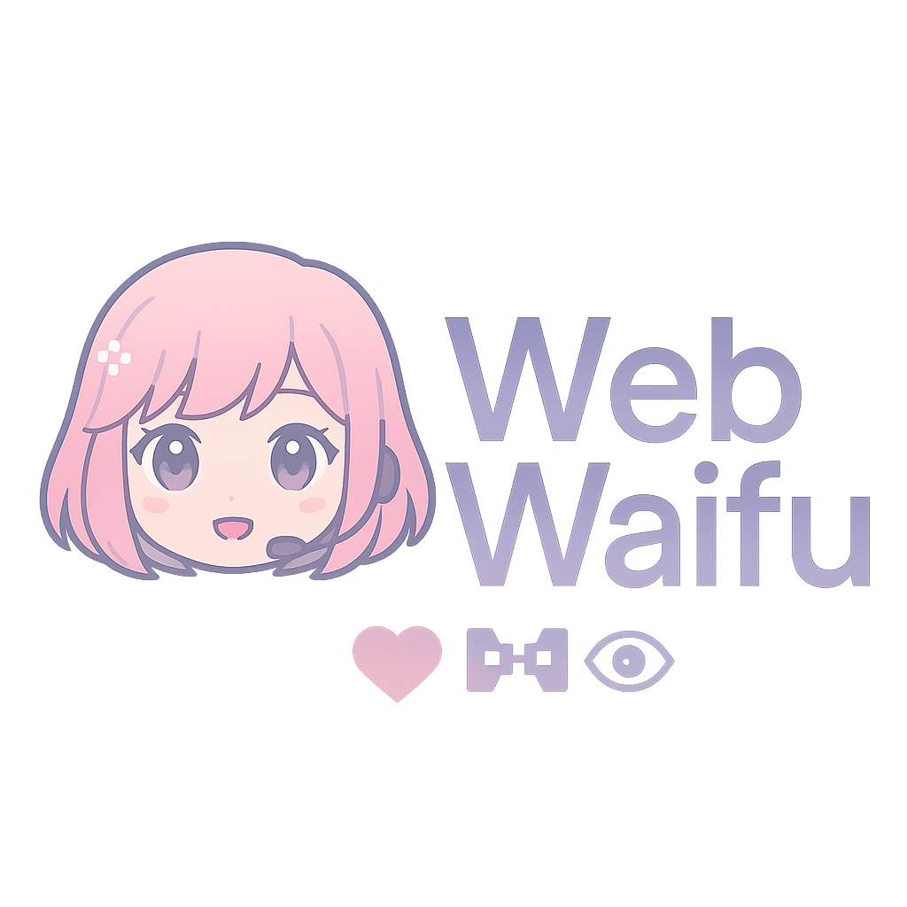

# Webwaifu 🤖💖

An interactive AI VTuber experience with VRM avatar support, real-time speech recognition, and dynamic responses. Chat with your AI companion through voice or text while watching them react with lifelike animations and expressions.



## ✨ Features

### 🎭 VRM Avatar Support
- **Load Custom Models**: Upload your own `.vrm` files.
- **Lifelike Animations**: Real-time facial expressions, mouth movement, and audio-reactive body gestures.
- **Full Customization**: Adjust your avatar's position, scale, and rotation. Fine-tune arm and elbow positioning for the perfect pose.

### 🎤 Advanced Speech Recognition
- **Whisper AI Integration**: High-accuracy, local speech-to-text using `Xenova/transformers`.
- **Browser Fallback**: Uses the built-in WebSpeech API if Whisper is unavailable.
- **Voice Hotkeys**: Set a key (like `Shift`, `Ctrl`, `Alt`) for always-on voice activation.

### 🤖 Multi-Provider AI Support
- **Google Gemini**: Integrates with the latest Gemini models for fast and creative responses.
- **OpenAI**: Supports various models including GPT-4o and GPT-4 Turbo.
- **Ollama**: Connect to a local Ollama instance to run your own models completely offline.
- **Unified System Prompt**: Define your AI's personality once, and it will apply across all providers for a consistent experience.

### 🔊 High-Quality Text-to-Speech
- **Azure Neural Voices**: Access premium, natural-sounding voices from Microsoft Azure.
- **Browser TTS Fallback**: A free, built-in alternative with a selection of voices.
- **Voice Customization**: Adjust the pitch, rate, and volume of the TTS voice.

### 📺 Streaming & Chat Integration
- **Twitch Chat**: Connect directly to your Twitch channel's chat.
- **Stream Mode**: An overlay interface designed for streaming, showing incoming chat messages.
- **Message Accumulation**: Batch process multiple chat messages at once to create a summary or respond to a conversation.

### 🎨 Customization Options
- **Custom Backgrounds**: Use your own images or videos as a backdrop for your avatar.
- **Visual Effects**: Apply curve and bend effects to the background for a more immersive scene.
- **Real-time Controls**: Adjust all parameters through the settings panel without needing to reload.

## 🚀 Quick Start

### Prerequisites
- A modern web browser (Chrome/Edge recommended for full feature support).
- **For AI features**: API keys for your chosen provider (Google Gemini or OpenAI).
- **For premium TTS**: An Azure Cognitive Services key (optional).
- **For local AI**: A running instance of [Ollama](https://ollama.com/) (optional).

### Installation
1.  **Clone the repository:**
    ```bash
    git clone https://github.com/your-username/webwaifu.git
    cd webwaifu
    ```

2.  **Open in browser:**
    - Simply open the `index.html` file in your web browser.
    - No build process or servers are required!

### First-Time Setup
1.  **Upload VRM Model**: In the settings panel, go to "📁 VRM Model" and upload your `.vrm` file.
2.  **Configure AI**: Go to "🤖 AI Configuration", select your provider, and enter your API key.
3.  **Configure Voice**: Set up your microphone and TTS preferences under "🎙️ Voice Controls" and "🔊 Text-to-Speech".
4.  **Start Chatting**: Use the text input at the bottom or the voice hotkey to interact with your AI companion!

## 🛠️ Technical Details

### Architecture
- **Frontend**: Vanilla JavaScript (ES6 Modules), HTML5, CSS3.
- **3D Rendering**: [Three.js](https://threejs.org/) with the `@pixiv/three-vrm` library.
- **Speech Recognition**: [Xenova/transformers.js](https://huggingface.co/docs/transformers.js) for client-side Whisper model execution.
- **Audio Processing**: The Web Audio API is used for real-time microphone analysis.
- **Settings Storage**: All your settings are saved locally in your browser's `localStorage`.

### Supported File Formats
- **VRM Models**: `.vrm` (VRM 0.x specification)
- **Backgrounds**: JPG, PNG, GIF, WEBP, MP4, MOV, AVI

## 🔧 Troubleshooting

- **Speech Recognition Not Working?**
  - Check that your browser has microphone permissions.
  - Ensure the correct microphone is selected in the settings.
  - Try refreshing the page to reload the Whisper model.

- **VRM Model Not Loading?**
  - Make sure it's a valid `.vrm` file.
  - Check the browser's developer console for any error messages.

- **AI Not Responding?**
  - Double-check that your API key is correct.
  - Ensure you have a stable internet connection.

## 🙏 Acknowledgments

This project is heavily based on the original **VU-VRM** project by itsTallulahhh and owes a great deal to the following open-source libraries:
- [Three.js](https://threejs.org/)
- [three-vrm](https://github.com/pixiv/three-vrm)
- [Transformers.js](https://github.com/xenova/transformers.js)